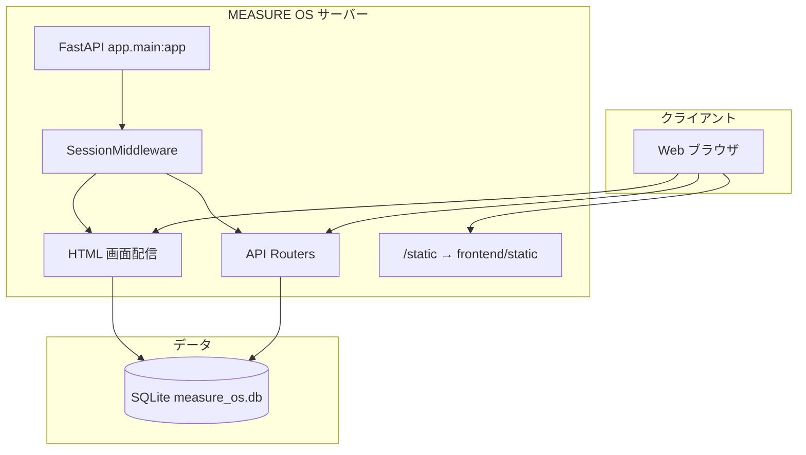
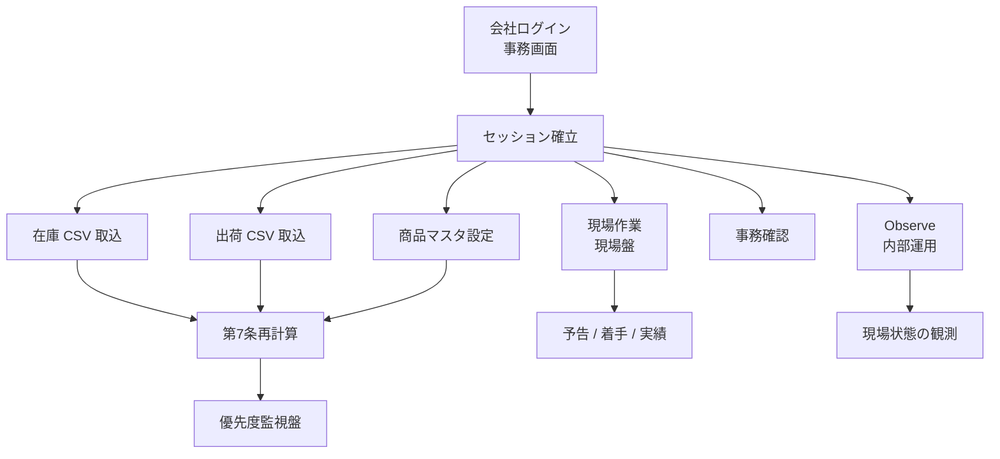

# MEASURE OS Package A
## Functional Specification
### Part 1

| 項目 | 内容 |
|------|------|
| 文書種別 | 機能仕様書（Part 1） |
| 対象範囲 | ① システム概要 / ② 認証・会社管理 / ③ 商品マスタ |
| 根拠 | リポジトリ `measureos-site` の実装コード（本書作成時点の `milestone/package-a-phase1` ブランチ） |
| Part 2 以降 | 未作成（本書の対象外） |
| Part 4 | API 詳細・DB 定義・エラー仕様等（本書から移管） |

---

Version: 1.1

対象システム  
MEASURE OS Package A

対象ブランチ  
milestone/package-a-phase1

最終更新日  
2026-06-26

対象読者  
・開発者  
・QA担当者  
・運用担当者

目的  
本書は MEASURE OS Package A の**機能仕様**を定義する。  
システムの目的、利用者、画面、業務フロー、各機能の振る舞いを整理することを目的とする。  
API 詳細、DB 定義、HTTP エラー仕様等の技術詳細は Part 4 で扱う。

---

## 目次

1. [第1章 システム概要](#第1章-システム概要)
   - 1.1 システム概要
   - 1.2 システム目的
   - 1.3 Package A 概要
   - 1.4 対象ユーザー
   - 1.5 画面一覧
   - 1.6 システム構成
   - 1.7 全体業務フロー
   - 1.8 Package A 対象機能
   - 1.9 制約事項
   - 1.10 未実装項目
2. [第2章 認証・会社管理](#第2章-認証会社管理)
   - 2.1 概要
   - 2.2 ログイン
   - 2.3 ログアウト
   - 2.4 セッション管理
   - 2.5 会社管理
   - 2.6 会社切替
   - 2.7 データ分離
   - 2.8 制約事項
   - 2.9 未実装項目
3. [第3章 商品マスタ](#第3章-商品マスタ)
   - 3.1 概要
   - 3.2 管理項目
   - 3.3 登録
   - 3.4 更新
   - 3.5 論理削除
   - 3.6 一覧表示
   - 3.7 CSV との連携
   - 3.8 制約事項
   - 3.9 未実装項目

---

# 第1章 システム概要

## 1.1 システム概要

MEASURE OS は、現場の行動ログ（予告・着手・実績・異常検知）を記録・可視化する Web アプリケーションである。

- **アプリケーション名:** MEASURE OS
- **形態:** Web ブラウザから利用する Web アプリケーション
- **バックエンド:** Python / FastAPI
- **データベース:** SQLite（本番環境ではサーバー上の単一 DB ファイルとして運用）
- **フロントエンド:** HTML + JavaScript（静的アセットを `/static` から配信）

## 1.2 システム目的

MEASURE OS の目的は、現場の行動ログを記録・可視化することである。

- **対象ログ種別:** 予告、着手、実績、異常検知
- **フェーズラベル:** フェーズ1：ログ取得

Package A では、現場を止めずに何が起きているかを観測可能にすることを優先する。

## 1.3 Package A 概要

Package A は「現場可観測基盤」として位置づけられる。

| 項目 | 内容 |
|------|------|
| ラベル | 現場可観測基盤 |
| タグライン | 現場を観測する |
| 説明 | 現場を止めずに、何が起きているかを観測可能にする。 |
| 対象条文 | 第1条A / 第3条A / 第5条A / 第7条A |
| 方針 | 異常を隠さない / まず残す / 現場の流れを観測する |

Package A ではフェーズ2（blue→red 等の高度な判定）は無効である。  
各導入企業の Package コード既定値は **A** である。

## 1.4 対象ユーザー

MEASURE OS Package A は、**導入企業が日常業務に利用する画面**と、**MEASURE OS 運営側が運用・保守・観測のために利用する内部運用画面**で構成される。

MEASURE OS は、導入企業が自ら運用するシステムではない。現場の観測・可視化を目的とし、**運用・保守・状態確認は MEASURE OS 運営側のシステム管理者が担当する**。内部運用画面は導入企業には提供しない。

| 区分 | 説明 |
|------|------|
| **現場担当** | 導入企業の現場担当者。**現場盤**を利用する |
| **事務担当** | 導入企業の事務担当者。**事務画面**、**商品マスタ**、**CSV 取込**（在庫・出荷）、**優先度監視盤（Priority）** を利用する |
| **MEASURE OS 管理者** | MEASURE OS 運営側のシステム管理者。**Observe**、**Monthly**、**Company 管理**、**Debug** 等の内部運用画面を利用する |

個人ユーザーアカウント（個人 ID）による認証モデルは **未実装** である（第2章参照）。

## 1.5 画面一覧

### 導入企業が利用する画面

| 製品仕様上の名称 | 主な URL | セッション | 概要 |
|----------------|---------|-----------|------|
| 現場盤 | `/field/v2` | 必要 | 現場での予告・着手・実績入力 |
| 事務画面 | `/office/v2` | 不要（ログイン画面） | 会社ログイン、事務確認 |
| 商品マスタ | `/product/master/v2` | 必要 | 商品コード・製造区分・基準在庫の管理 |
| CSV 取込（在庫） | `/stock/import/v2` | 必要 | 在庫 CSV の取込 |
| CSV 取込（出荷） | `/shipment/import/v2` | 必要 | 出荷 CSV の取込 |
| 優先度監視盤（Priority） | `/priority/v2` | 必要 | 第7条の優先順位表示（表示のみ・現場は変更しない） |
| 第7条入力 | `/priority/input/v2` | 不要 | 第7条関連の入力（セッション非連動） |

`/field/v2` には `/現場/v2`、`/genba/v2` 等のエイリアスが存在する。  
`/field`（旧版）はレガシー画面として残存する。

### 内部運用画面（MEASURE OS 管理者向け）

導入企業には提供しない。MEASURE OS 運営側のシステム管理者が、観測・状態確認・保守のために利用する。

| 製品仕様上の名称 | 主な URL | セッション | 概要 |
|----------------|---------|-----------|------|
| Observe | `/sr/v2` | 不要 | 導入企業の現場状態を読取専用で観測・可視化 |
| Monthly | `/sr/monthly` | 不要 | 月次レポート等の参照・作成 |
| Company 管理 | `/admin/companies/ui` | 不要 | 会社マスタの登録・参照 |
| Debug | `/debug` · `/debug/v2` | 不要 | 開発・保守用の状態確認 |

内部実装 URL（`/sr/*` 等）と製品仕様名の対応、および route summary 等の内部実装上の名称は Part 4 で記載する。

## 1.6 システム構成

MEASURE OS は、Web ブラウザから HTML 画面および API にアクセスする構成である。  
導入企業向け画面の認証状態は署名付き Cookie によるセッションで管理する。  
業務データは SQLite 上で会社単位（`company_id`）に保持される。

## 1.7 全体業務フロー

Package A における主要業務フローは以下のとおりである。

**導入企業の典型フロー**

1. 事務担当が事務画面で会社ログインする
2. 在庫 CSV・出荷 CSV を取込み、商品マスタを整備する
3. 第7条の再計算を実行し、優先度監視盤で優先順位を確認する
4. 現場担当が現場盤で予告・着手・実績を入力する
5. 事務担当が事務画面で状態を確認する

**MEASURE OS 管理者の運用フロー**

- Observe により、導入企業の現場状態を読取専用で観測・可視化する
- Company 管理により、導入企業の会社マスタを登録・参照する

Part 1 対象外の機能（第5条現場、第7条詳細、Observe API 等）の技術詳細は Part 2 以降および Part 4 で扱う。

## 1.8 Package A 対象機能

本 Part 1 が扱う機能:

| 機能 | 状態 |
|------|------|
| 会社ログイン（会社 ID + パスワード） | 実装済 |
| セッションによる会社スコープ | 一部画面で実装済 |
| 商品マスタ（登録・更新・論理削除・一覧） | 実装済 |
| 会社マスタ（Company 管理） | 実装済 |

Package A 全体に含まれるが、本 Part 1 の対象外とする機能:

- 第5条: 現場盤、作業単位（予告・着手・実績）
- 第7条: 優先度監視盤、CSV 取込、再計算
- Observe（内部運用画面）
- 営業日カレンダ

## 1.9 制約事項

| 制約 | 説明 |
|------|------|
| フェーズ2無効 | Package A では blue→red 等のフェーズ2判定は行わない |
| 異常検知はブロックしない | フェーズ1では異常を記録するが、現場操作を止めない |
| 在庫減算・BOM・ロット管理なし | 在庫の自動減算や BOM 展開は行わない |
| 第7条 rebuild | `open` 状態の優先度行のみ再生成し、`closed` 行は温存する |
| 認証単位 | 会社単位のみ。個人ユーザー・ロールベース権限は未実装 |

## 1.10 未実装項目

| 項目 | 説明 |
|------|------|
| 個人ユーザー認証・RBAC | ユーザー / ロールモデルなし。セッションは company_id のみ保持 |
| 全 API への company_id 検証統一 | 一部 API ではセッション検証が未接続 |
| Package A 専用ドキュメント | コード内メタデータのみ。独立した製品ドキュメントは未整備 |
| 未登録ルータ | `work_units.py`、`items.py` はアプリに未登録 |

---

# 第2章 認証・会社管理

## 2.1 概要

MEASURE OS Package A の認証単位は **会社（company_id）** である。

- **認証方式:** 会社 ID + パスワード
- **セッション:** 署名付き Cookie に `company_id` のみ保持（パスワード・ユーザー ID・ロールは保持しない）
- **パスワード:** 会社マスタ上で bcrypt ハッシュとして保存

ロールベースのアクセス制御（RBAC）は **未実装** である。  
アクセス制御は、セッションに紐づく `company_id` と、操作対象データの `company_id` の一致によって行われる。

Company 管理（内部運用画面）は MEASURE OS 管理者向けであり、導入企業向け画面ではない。現時点では Company 管理 API に対する認証は設けられていない。

## 2.2 ログイン

### 画面

| 項目 | 内容 |
|------|------|
| 画面 | 事務画面 |
| URL | `/office/v2` |
| 認証要否 | 不要（ログイン画面自体） |

### 入力

| 項目 | 必須 | 説明 |
|------|------|------|
| 会社 ID（company_id） | はい | 前後空白は除去して照合 |
| パスワード | はい | 会社マスタに登録されたパスワード |

### 処理

1. 会社 ID を正規化（trim）する
2. 会社 ID またはパスワードが空の場合、ログイン失敗とする
3. 会社マスタを参照し、以下いずれかに該当する場合、ログイン失敗とする（理由は利用者に区別しない）:
   - 会社が存在しない
   - 会社が無効（inactive）
   - パスワードが未設定
   - パスワードが一致しない
4. 成功時、セッションに `company_id` を保存する

### ログイン後遷移

- クエリ `return_to` が安全な内部パスと判定された場合、そのパスへ遷移する
- それ以外は事務画面に留まる

`return_to` の安全判定:

- 許可: `/` で始まる相対パス
- 禁止: `//` 始まり、スキーム含有（`://`）、バックスラッシュ含有

## 2.3 ログアウト

ログアウト時は以下を行う。

- サーバー側セッションをクリアする
- クライアント側で `localStorage` / `sessionStorage` に保存された `company_id` および現場用の関連キーをクリアする

## 2.4 セッション管理

### セッションの内容

| 項目 | 内容 |
|------|------|
| 保持する情報 | `company_id`（trim 済み） |
| 保持しない情報 | パスワード、ユーザー ID、ロール |

### セッション確認

ログイン状態はセッション確認 API により取得できる。  
セッションが無効、または会社マスタ上で会社が存在しない・無効な場合、未認証として扱う。

### セッション必須画面

未認証で以下の画面にアクセスした場合、事務画面（ログイン）へリダイレクトし、元 URL を `return_to` として付与する。

- 現場盤（`/field/v2` およびエイリアス）
- 優先度監視盤（`/priority/v2`）
- CSV 取込（在庫・出荷）
- 商品マスタ（`/product/master/v2`）

### 画面への会社情報注入

セッション必須画面では、サーバーが HTML 応答に会社 ID 等を注入し、クライアントがセッションと一致する会社コンテキストで動作する。  
現場盤では、会社設定に基づく現場ユーザー情報も注入される。

## 2.5 会社管理

### 会社マスタ

各導入企業は `company_id` により識別される。会社マスタには以下を保持する。

| 項目 | 説明 |
|------|------|
| company_id | 会社識別子（一意） |
| company_name | 表示名 |
| company_password_hash | ログイン用パスワード（bcrypt ハッシュ） |
| is_active | 有効フラグ。無効な会社はログイン不可 |

### Company 管理（内部運用画面）

MEASURE OS 管理者は Company 管理画面（`/admin/companies/ui`）により、会社マスタの登録・参照を行う。

- 導入企業には提供しない
- 会社の新規登録、有効 / 無効の切替、名称変更等を行う
- Observe 等の内部運用画面から会社検索に利用される

### 会社 ID の検証

業務操作では、以下の検証が行われる。

| 条件 | 結果 |
|------|------|
| company_id が空 | エラー |
| 会社マスタに未登録 | エラー |
| 会社が無効（inactive） | エラー |
| セッション必須操作でセッションと不一致 | エラー |

起動時には、既存業務データに出現する `company_id` のうち、会社マスタに未登録のものを自動的にバックフィルする。

### 会社設定

会社ごとの業務設定（数量単位、許容差、営業日境界、Package コード等）は会社設定として保持される。  
Package A では `package_code` の既定値は **A** である。

## 2.6 会社切替

### 導入企業向け画面（セッション連動）

| 項目 | 内容 |
|------|------|
| アプリ内会社切替 UI | **未実装** |
| 切替方法 | ログアウト → 別 company_id で再ログイン |
| 事務画面 | セッションの company と UI 入力が不一致の場合、セッション値に強制同期 |

セッション連動画面: 事務画面、現場盤、優先度監視盤、CSV 取込、商品マスタ。

### Observe（内部運用画面）

MEASURE OS 管理者向けの内部運用画面。導入企業向け画面ではない。

| 項目 | 内容 |
|------|------|
| 製品仕様上の名称 | Observe |
| 内部実装 URL | `/sr/v2` |
| セッション | 不使用（導入企業の会社ログインセッションとは独立） |
| 会社の指定 | URL クエリ `company` または `company_id` |
| ページ読込時 | `localStorage` から company を復元しない |

### 第7条入力（`/priority/input/v2`）

| 項目 | 内容 |
|------|------|
| セッション | 不使用 |
| 会社の指定 | 画面内入力、`?company=` クエリ、`localStorage` |

### URL パラメータとセッション

| 画面群 | URL の company パラメータ | 正とする company ソース |
|--------|-------------------------|------------------------|
| セッション連動画面（導入企業向け） | 無視 | サーバーセッション |
| 事務画面 | `return_to` のみ使用 | セッション |
| Observe | `?company=` / `?company_id=` を読取 | URL（クライアント） |
| 第7条入力 | `?company=` + localStorage | クライアント入力 |

## 2.7 データ分離

- 業務データは `company_id` により論理的に分割される
- セッション必須の操作では、操作対象の `company_id` がセッションと一致することを要求する
- 一部 API（現場作業等）は `company_id` クエリによるフィルタのみで、セッション検証を行わない

## 2.8 制約事項

| 制約 | 説明 |
|------|------|
| 認証は会社単位のみ | 個人アカウント・ロールは未実装 |
| セッション必須は一部のみ | 全画面・全 API がセッション必須ではない |
| Company 管理 API | 認証なし。内部運用画面（Company 管理）専用 |
| 会社切替 | 同一ブラウザでの切替はログアウト必須 |
| ログイン失敗時 | 失敗理由（未知会社 / パスワード誤り / inactive / パスワード未設定）を同一メッセージで返す |
| セッション確認 | パスワード情報は返却しない |

## 2.9 未実装項目

| 項目 | 説明 |
|------|------|
| 個人ユーザーアカウント | モデル・API なし |
| ロールベースアクセス制御 | 未実装 |
| 全 API への company 検証 | 一部 API で未接続 |
| Company 管理 API の認証 | 認証なし（内部運用専用） |
| セッション DB 永続化 | Cookie ベースのみ |
| 第7条入力のセッションゲート | セッションブートストラップなし |
| Observe のサーバーセッション連動 | URL ベースの会社指定（内部運用のため非連動） |

---

# 第3章 商品マスタ

## 3.1 概要

商品マスタは、導入企業ごとの商品辞書として機能する。

| 用途 | 説明 |
|------|------|
| 第5条 | 現場は商品名（label）で入力し、裏側で product_code を紐づけ可能 |
| 第7条 | 製造区分・基準在庫を保持し、優先度監視盤（Priority）の計算に利用 |
| 運用 | 事務担当が **商品マスタ** 画面（`/product/master/v2`）で管理 |

商品マスタは **蓄積型** である。CSV 取込等による自動追加は行うが、既存行の破壊的更新や削除は行わない設計とする。

## 3.2 管理項目

| 項目 | 説明 |
|------|------|
| ID | 行 ID（システム採番） |
| company_id | 所属会社 |
| label | 商品名（会社内で一意） |
| product_code | 商品コード（未設定可） |
| production_mode | 製造区分: `manufacture`（自社製造）または `purchase`（商社・仕入） |
| safety_stock_value | 基準在庫（安全在庫）。未設定時は計算上 0 として扱う |
| is_active | 有効フラグ |
| created_at / updated_at | 作成・更新日時 |

### 製造区分の表示

| 値 | 画面表示 |
|-----|---------|
| manufacture | 自社製造 |
| purchase | 商社・仕入 |

## 3.3 登録

### 手動登録（画面）

| 項目 | 内容 |
|------|------|
| 画面 | 商品マスタ（`/product/master/v2`） |
| 操作 | 「新規商品追加」→ 商品名入力 → 「追加」 |
| 認証 | セッション必須 |
| 初期値 | product_code 未設定、有効（is_active=true）、製造区分は自社製造 |

### 自動追加（ensure）

label が存在しない場合のみ 1 件追加する。既存行は更新しない。  
新規行は product_code 未設定、製造区分は自社製造とする。

### 現場作業からの自動追加

第5条の実績行に含まれる商品名（label）から ensure により追加される。詳細は Part 2 以降（第5条）で扱う。

## 3.4 更新

### 画面から更新可能な項目

各行の「保存」操作により、以下を更新できる。

- 商品コード（空の場合は未設定として保存）
- 製造区分
- 基準在庫（空の場合は未設定）

**商品名（label）の画面編集は未実装**（一覧上は read-only 表示）。

### 更新ルール

- 同一会社内で商品名（label）の重複は不可
- 有効行（is_active=true）間で product_code の重複は不可
- 無効行との product_code 重複は許可
- 基準在庫は 0 以上の整数、または未設定

## 3.5 論理削除

| 操作 | 状態 |
|------|------|
| 物理削除 | **未実装**（一般 API・画面からは不可） |
| 論理削除 | 有効化 / 無効化操作により `is_active=false` に設定 |

一覧画面では「無効行も含める」チェック（**既定: オン**）により、無効行の表示 / 非表示を切替できる。

## 3.6 一覧表示

### 画面

| 項目 | 内容 |
|------|------|
| URL | `/product/master/v2` |
| タイトル | MEASURE OS — 商品マスタ |
| 認証 | セッション必須。未認証時は事務画面へリダイレクト |

### レイアウト

1. ヘッダー（タイトル、説明、関連画面ナビ）
2. メッセージ欄
3. 新規商品追加パネル
4. 商品一覧テーブル

### テーブル列

| 列 | 編集 |
|----|------|
| ID | 表示のみ |
| 商品名 | 表示のみ |
| 商品コード | 入力可 |
| 製造区分 | 選択可 |
| 基準在庫 | 入力可 |
| 状態 | 有効 / 無効（表示） |
| 操作 | 保存 / 無効化 または 有効化 |

### 関連画面

優先度入力、在庫 CSV 取込、出荷 CSV 取込、優先度監視盤、事務画面へのリンクを提供する。

### 画面未搭載機能

| 機能 | 状態 |
|------|------|
| ensure 操作ボタン | **未実装** |
| 商品名（label）の編集 | **未実装** |
| 商品マスタ CSV 一括取込 UI | **未実装** |
| 物理削除 UI | **未実装** |

## 3.7 CSV との連携

在庫 CSV 取込・出荷 CSV 取込の際、CSV に含まれる商品は商品マスタへ **追加のみ** 行われる。

| ルール | 説明 |
|--------|------|
| 未存在時 | 新規行を追加 |
| 既存行 | 更新しない（基準在庫・製造区分等を保持） |
| CSV に無い商品 | 削除しない |
| 空エントリ | product_code と label が両方空の行はスキップ |
| 重複 | 既存 product_code または label が一致する場合はスキップ |

商品マスタ専用の CSV 一括取込 API は **未実装** である。

## 3.8 制約事項

| 制約 | 説明 |
|------|------|
| 蓄積型（非破壊） | CSV 取込は master を更新・削除しない |
| 会社内 label 一意 | 同一 company_id 内で商品名は一意 |
| セッション company のみ操作可 | ログイン中の会社のデータのみ操作可能 |
| active 行間 product_code 一意 | 有効行間での product_code 重複不可 |
| inactive 行との重複 | 無効行との product_code 重複は許可 |

## 3.9 未実装項目

| 項目 | 説明 |
|------|------|
| 単件取得 API | 行 ID 指定の GET は未提供 |
| 物理削除 API | DELETE は未提供 |
| 商品マスタ CSV 一括取込 API | 未提供 |
| 画面からの label 編集 | 商品名は read-only |
| 画面からの ensure 操作 | ボタンなし |
| 画面からの物理削除 | なし |

---

## 改訂履歴

| 版 | 日付 | 内容 |
|----|------|------|
| Part 1 初版 | コードベース `milestone/package-a-phase1` 時点 | 第1章〜第3章 |
| 1.0 改訂 | 2026-06-26 | 製品思想に合わせた用語統一（内部運用画面、MEASURE OS 管理者、観測・可視化等） |
| 1.1 改訂 | 2026-06-26 | Part 1 として機能仕様書へ再構成。API / DB / エラー詳細を Part 4 へ移管 |
