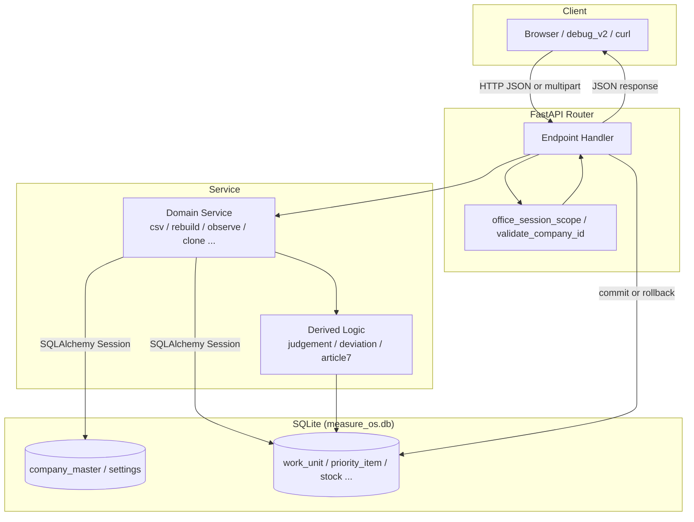

# MEASURE OS Package A — Part4 調査整理

| 項目 | 内容 |
|------|------|
| 文書種別 | QA 外注用機能仕様書のための調査整理（Part4） |
| 対象範囲 | ⑩ API仕様 / ⑪ DB仕様 / ⑫ エラー仕様 |
| 根拠 | リポジトリ `measureos-site` の実装コード |
| 注意 | 本書は仕様書ではない。コードから読み取った事実の整理 |

**責務分界**

- Part1〜3: 画面・業務フロー・利用者向け説明
- Part4（本書）: API・DB・HTTP エラーのみ

---

## 調査対象ファイル一覧

| 区分 | ファイル |
|------|---------|
| **router（main.py 登録済み）** | `app/routers/office_session.py`, `app/routers/admin_companies.py`, `app/routers/v2.py`, `app/routers/working_calendar.py`, `app/routers/csv_import_meta.py`, `app/routers/stock.py`, `app/routers/shipment.py`, `app/routers/product_master.py`, `app/routers/priority.py`, `app/routers/work.py`, `app/routers/sr_observe.py`, `app/routers/sr_monthly.py`, `app/routers/test_control.py`, `app/routers/settings.py` |
| **router（リポジトリ内・未登録）** | `app/routers/work_units.py`（prefix `/作業記録`）, `app/routers/items.py`（prefix `/対象`） |
| **service** | `app/services/office_session_scope.py`, `app/services/company_validator.py`, `app/services/company_password.py`, `app/services/company_provisioning.py`, `app/services/company_search.py`, `app/services/stock_csv.py`, `app/services/shipment_csv.py`, `app/services/csv_header_normalizer.py`, `app/services/product_master.py`, `app/services/priority_rebuild.py`, `app/services/article7_priority_phase1.py`, `app/services/article7_safety_stock.py`, `app/services/article7_deviation.py`, `app/services/article3_cutoff_observe.py`, `app/services/priority_article7_context.py`, `app/services/work_unit_clone.py`, `app/services/work_unit_guard.py`, `app/services/field_users.py`, `app/services/anomaly_classification.py`, `app/services/business_date.py`, `app/services/judgement_promote.py`, `app/services/package_a_observe.py`, `app/services/monthly_report.py`, `app/services/working_calendar.py`, `app/services/test_clock.py`, `app/services/status_history.py`, `app/services/audit_head.py`, `app/services/actual_revision.py`, `app/services/production_mode.py`, `app/services/package_rules.py` |
| **models** | `app/models.py` |
| **schemas** | `app/schemas.py` |
| **middleware / auth** | `app/main.py`（`SessionMiddleware`）, `app/services/office_session_scope.py`, `app/services/company_validator.py`, `app/services/company_password.py` |
| **migration** | `app/main.py`（`_sqlite_migrate`, `create_all`）, `alembic/versions/*.py`（9 ファイル） |
| **database** | `app/database.py` |
| **tests** | `tests/test_stock_shipment_import_session_scope.py`, `tests/test_priority_session_company.py`, `tests/test_field_session_company.py`, `tests/test_sr_observe_dashboard.py`, `tests/test_planned_registration.py`, `tests/test_field_classification_aggregate.py`, `tests/test_sr_monthly_url_state.py`, `tests/test_csv_header_normalizer.py`, `tests/test_article7_*.py` 他 |

---

# API 共通仕様

## 認証方式

| 方式 | 実装 | 利用 API |
|------|------|---------|
| **セッション Cookie** | `starlette.middleware.sessions.SessionMiddleware`（`main.py`）。キー `MEASUREOS_SESSION_SECRET`（未設定時は dev 固定文字列） | `POST /v2/office/login` で `request.session["company_id"]` 設定 |
| **session 必須 + company 一致** | `require_session_company_match` / `require_session_company_row`（`office_session_scope.py`） | 在庫/出荷 CSV、商品マスタ CRUD |
| **session なし** | ガードなし | Priority、Work、Observe、Monthly、Admin、v2 会社設定、営業日、legacy `/settings` 等 |
| **パスワード検証** | `company_master.company_password_hash` + bcrypt 系（`company_password.py`） | ログインのみ |

## company_id の扱い

| 関数 | 挙動 | HTTP |
|------|------|------|
| `normalize_company_id` | trim のみ | — |
| `validate_company_id` | `company_master` に存在かつ `is_active` | 空/未登録 → 422 `company_id is not registered` / 無効 → 403 `company is inactive` |
| `ensure_company_registered` | 未登録なら `company_master` INSERT | 無効 → 403 |
| `require_session_company_match` | session company とリクエスト company 一致 | 未ログイン 401 / 不一致 403 / 空 422 |
| `validate_unit_company_id` | work_unit 行の company を `validate_company_id` | 同上 |

**注記（コードコメント）**

- `admin_companies.py`: 「認証なし・全 API への company_id 検証は未接続」
- `company_master` モデル docstring: 「API 全体検証は未接続」（`validate_company_id` は個別 router で使用）

## session の扱い

- 保持内容: `company_id` のみ（個人ユーザー・ロールなし）
- ログイン: `POST /v2/office/login` → session 設定
- 確認: `GET /v2/office/session` → 401 `not authenticated`（session なし / 無効会社）
- ログアウト: `POST /v2/office/logout` → session クリア
- HTML bootstrap: `main.py` の `_session_bootstrap_html_response` が session company を `window.__MO_BOOTSTRAP_COMPANY__` 注入（API ではない）

## bootstrap（HTML）

| 画面 URL | 注入 |
|---------|------|
| `/priority/v2`, `/stock/import/v2`, `/shipment/import/v2`, `/product/master/v2`, `/field/v2` 等 | `__MO_BOOTSTRAP_COMPANY__` |
| `/field/v2` 追加 | `__MO_FIELD_USERS_RAW__` |

未ログイン時: 307 → `/office/v2?return_to=...`

## 共通レスポンス

| 項目 | 内容 |
|------|------|
| 成功 | 通常 JSON（Pydantic `response_model` または dict） |
| 失敗 | FastAPI 標準 `{ "detail": ... }`（`detail` は string または validation error 配列） |
| CSV 取込成功 | `{ ok, success_count, error_count }` |
| エラー時 rollback | 在庫/出荷 import: `except Exception: db.rollback(); raise` |

## HTTP Status（Package A でコード上確認できるもの）

| Status | 主な用途 |
|--------|---------|
| **401** | session なし、ログイン失敗 |
| **403** | session company 不一致、無効会社 |
| **404** | リソース未存在、テスト API 無効、未知 CSV スキーマ、frontend 404 |
| **409** | `work_unit.status == closed` への更新拒否 |
| **422** | バリデーション、CSV fatal、業務ルール違反 |
| **400** | 一部 legacy / planned-due / package_code（v2） |
| **500** | 明示ハンドラなし。未捕捉例外は FastAPI デフォルト |

## JSON 形式

- リクエスト/レスポンス: Pydantic v2 モデル（`app/schemas.py`）
- 日時: ISO 8601 文字列（末尾 `Z` 付与箇所あり）
- Work 行: `WorkUnitOut`（多数フィールド・派生フラグ含む）

## API 命名規則・router 構成

| パターン | 例 |
|---------|-----|
| Package A v2 | prefix `/v2/...` |
| 管理 | `/admin/companies` |
| Legacy | prefix なし `/settings`, `/work`, `/calendar` |
| 二重登録 | `work.router` が prefix なし + `/v2` の両方（同一 handler） |
| タグ | OpenAPI tags（日本語） |

## service 呼び出し構成

```
Router
  → validate_company_id / require_session_* （入口）
  → domain service（csv, rebuild, observe, monthly, clone…）
  → SQLAlchemy Session commit/rollback
  → schema 変換（_row_to_out, _unit_to_out）
```

---

# ⑩ API 仕様

## ■ API 一覧

| API | Method | 用途 |
|-----|--------|------|
| `/v2/office/login` | POST | 会社ログイン（session） |
| `/v2/office/session` | GET | session 確認 |
| `/v2/office/logout` | POST | ログアウト |
| `/admin/companies` | GET | 会社マスタ一覧 |
| `/admin/companies/search` | GET | 会社検索 |
| `/admin/companies` | POST | 会社マスタ新規 |
| `/admin/companies/{row_id}` | PATCH | 会社マスタ更新 |
| `/v2/companies` | GET | company_settings 由来 ID 一覧 |
| `/v2/companies` | POST | 新規会社（ID・パスワード自動生成） |
| `/v2/company/{company_id}` | GET | 会社スナップショット |
| `/v2/company/{company_id}/leaders` | PUT | 班長・業務ルール保存 |
| `/v2/company/{company_id}/password/reissue` | POST | パスワード再発行 |
| `/v2/working-calendar` | GET | 営業日カレンダー取得 |
| `/v2/company-settings/working-days` | PATCH | 基本曜日・例外日保存 |
| `/v2/csv/import-schemas/{schema_name}` | GET | CSV ヘッダースキーマ |
| `/v2/stock/import` | POST | 在庫 CSV 全置換 |
| `/v2/shipment/import` | POST | 出荷 CSV 全置換 |
| `/v2/product-master` | GET/POST | 商品マスタ一覧・作成 |
| `/v2/product-master/ensure` | POST | ラベル ensure |
| `/v2/product-master/{row_id}` | PATCH | 商品マスタ更新 |
| `/v2/priority/items` | GET | 第7条 open 一覧 |
| `/v2/priority/rebuild` | POST | 第7条再生成 |
| `/v2/priority/create` | POST | 第7条手入力（open 全置換） |
| `/v2/priority/close` | POST | 第7条クローズ |
| `/work/*` および `/v2/work/*` | 各種 | 作業記録（下表） |
| `/v2/sr/observe-dashboard` | GET | 単社 Observe |
| `/v2/sr/observe-portfolio` | GET | 全社ポートフォリオ |
| `/v2/sr/monthly-report/aggregate` | GET | 月報集計 |
| `/v2/sr/monthly-report` | POST | 月報保存 |
| `/v2/sr/monthly-report/print` | GET | 月報 HTML 印刷 |
| `/v2/test/clock` | GET/POST | 擬似 UTC（debug） |
| `/v2/test/recompute` | POST | 再判定（debug） |
| `/settings/*`, `/calendar` | 各種 | legacy 設定（v2 非推奨コメント） |

**Work 系（`/work` = `/v2/work` 同一）**

| API | Method | 用途 |
|-----|--------|------|
| `.../work/next-business-date` | GET | 次営業日（行作成なし） |
| `.../work` | POST | 作業壳取得/作成 |
| `.../work/next-day` | POST | 次営業日開始 |
| `.../work/list` | GET | 一覧（最大 200） |
| `.../work/{id}/status-history` | GET | status 履歴 |
| `.../work/{id}/planned` | POST | 予告 |
| `.../work/{id}/start` | POST | 着手 |
| `.../work/{id}/actual` | POST | 実績 |
| `.../work/{id}/planned-due` | POST | 予告行 due_date マージ |
| `.../work/{id}/close` | POST | 事務完了（closed） |
| `.../work/{id}/reflection` | PATCH | 反映判断 |
| `.../work/recalc-missing-boundary` | POST | 無効化 stub |
| `.../work/debug-reset` | POST | 全 work 削除（debug） |
| `.../work/debug-set-business-date` | POST | business_date 変更（debug） |

**未登録 router（main.py に include なし）**

| ファイル | prefix | 状態 |
|---------|--------|------|
| `work_units.py` | `/作業記録` | 日本語 legacy API |
| `items.py` | `/対象` | `models.TaskItem` / `schemas.TaskItem*` が models/schemas に存在しない |

---

## 認証・会社（Office / Admin / v2 Company）

### POST `/v2/office/login`

| 項目 | 内容 |
|------|------|
| **認証** | 不要 |
| **入力** | `OfficeLoginIn`: `company_id`, `password` |
| **出力** | `{ company_id, company_name, authenticated: true }` |
| **主処理** | `company_master` 照合 → パスワード検証 → session 設定 |
| **更新** | session（DB なし） |
| **バリデーション** | 空 ID/パスワード → 401 |
| **エラー** | 401 `会社IDまたはパスワードが正しくありません`（未登録・無効・パスワード未設定・不一致すべて同一） |

### GET `/v2/office/session`

| 項目 | 内容 |
|------|------|
| **認証** | session 必須 |
| **出力** | `OfficeSessionOut` |
| **エラー** | 401 `not authenticated`（session なし / 会社無効時 session clear 後） |

### POST `/v2/office/logout`

| 項目 | 内容 |
|------|------|
| **出力** | `{ ok: true }` |
| **更新** | session クリア |

### Admin `/admin/companies*`

| 項目 | 内容 |
|------|------|
| **認証** | なし |
| **GET /** | `active_only` クエリ。`CompanyMasterOut[]` |
| **GET /search** | `q` 部分一致（active のみ、`company_search.py`） |
| **POST /** | body: `company_id`, `company_name`。INSERT。重複 422 |
| **PATCH /{row_id}** | `company_name`, `is_active`。404/422 |
| **更新** | `company_master` |

### POST `/v2/companies`

| 項目 | 内容 |
|------|------|
| **認証** | なし |
| **入力** | `company_name`, `package_code`（A/B/C/D） |
| **出力** | `V2CompanyCreateOut`（`initial_password` 平文） |
| **主処理** | `generate_unique_company_id` → `company_master` + `company_settings` INSERT |
| **エラー** | 422 会社名空 / 400 package 不正 |

### PUT `/v2/company/{company_id}/leaders`

| 項目 | 内容 |
|------|------|
| **認証** | なし |
| **入力** | `V2LeadersPut`: leaders[], day_boundary_time, tolerance_value, package_code, order_cutoff_time, company_name, company_password（任意） |
| **主処理** | `ensure_company_registered` → `company_settings` 更新 → パスワード hash 更新可 |
| **更新** | `company_settings`, `company_master`（名前）, password hash |
| **エラー** | 400 時刻形式 / 422 company 無効 |

### GET `/v2/company/{company_id}`

| 項目 | 内容 |
|------|------|
| **認証** | なし |
| **出力** | field_users, input_mode, unit, day_boundary_time, order_cutoff_time, tolerance, package メタ, has_password |
| **備考** | settings 行なしでも 200（デフォルト値返却）。`validate_company_id` は呼ばない |

---

## CSV・商品マスタ

### POST `/v2/stock/import` / `/v2/shipment/import`

| 項目 | 内容 |
|------|------|
| **認証** | session + company 一致 + `validate_company_id` |
| **入力** | multipart: `file`, `company_id`（Form） |
| **出力** | `StockImportOut` / `ShipmentImportOut` |
| **主処理** | デコード → parse → 重複排除 → **当該 company 全 DELETE** → INSERT → `ensure_product_master_entries` → commit |
| **更新** | `stock_item` / `shipment_plan_item`, `product_master`（追加のみ） |
| **422 fatal 例** | `CSVが空です`, `データ行がありません`, 必須列不足（`format_missing_header_error`） |
| **rollback** | DB 例外時 rollback 後 re-raise |

### GET `/v2/csv/import-schemas/{schema_name}`

| 項目 | 内容 |
|------|------|
| **認証** | なし |
| **入力** | `stock` / `shipment`（`IMPORT_SCHEMAS` キー） |
| **404** | 未知スキーマ + 利用可能一覧 |

### `/v2/product-master*`

| API | 認証 | 主処理 | 主な 422 |
|-----|------|--------|---------|
| GET | session+match | 一覧 | company 空/未登録 |
| POST | session+match | label 新規 INSERT | label 空/重複 |
| POST /ensure | session+match | 無ければ INSERT | label 空 |
| PATCH /{id} | session+row match | label/code/safety_stock/production_mode/is_active | 404, label/code 重複, safety_stock 非整数 |

**備考**: PATCH で `is_active=false` は論理無効化。物理 DELETE API なし。

---

## Priority（第7条）

### GET `/v2/priority/items`

| 項目 | 内容 |
|------|------|
| **認証** | なし |
| **Query** | `company_id`（必須）, `article5_progress`（bool, default false） |
| **出力** | `PriorityItemsOut.items[]`（**status=open のみ**） |
| **主処理** | DB 取得 → `_priority_sort_key` → enrich（safety, article7 context, article5 progress, production_mode） |
| **422** | company_id 空 |

### POST `/v2/priority/rebuild`

| 項目 | 内容 |
|------|------|
| **認証** | なし |
| **入力** | `PriorityRebuildIn.company_id` |
| **主処理** | `validate_company_id` → `rebuild_priority_items_for_company` |
| **更新** | **open の priority_item DELETE** → 出荷×在庫から INSERT。closed 温存 |
| **計算** | `required_qty = max(0, ship - (stock - safety_master))`。due パース不可はスキップ |
| **出力** | `{ ok, success_count, warning_count, detail }` |

### POST `/v2/priority/create`

| 項目 | 内容 |
|------|------|
| **認証** | なし |
| **入力** | `items[]`: label, ship_value, prod_value, due_date |
| **更新** | open 全 DELETE → 新規 INSERT（`is_after_cutoff` 付与） |
| **422** | 数値不正 / prod > ship / due 形式 / label 空スキップ（黙って除外） |

### POST `/v2/priority/close`

| 項目 | 内容 |
|------|------|
| **入力** | `company_id`, `item_ids[]` |
| **更新** | 該当 open 行 → `status=closed` |
| **422** | item_ids 空 / ID 不在 |

---

## Work（作業記録）

### 共通

| 項目 | 内容 |
|------|------|
| **認証** | なし（`validate_company_id` は company 引数がある endpoint のみ） |
| **更新方式** | **append-only**: `clone_work_unit_row` → 新行 INSERT。派生列は `strip_derived_columns_for_fact_snapshot` 後再計算 |
| **closed** | `raise_if_closed` → **409** |
| **自然キー** | `(company_id, task_id, process_id, user_id, business_date)` — 最新 id が有効行 |

### POST `/v2/work`

| 項目 | 内容 |
|------|------|
| **入力** | `WorkUnitQuery`: company_id, task_id, process_id, user_id, business_date（任意） |
| **主処理** | 同一営業日・未完了行があれば resume。`actual_at` 済みなら新 INSERT |
| **更新** | `work_unit` INSERT または既存返却 |

### POST `/v2/work/{id}/planned`

| 項目 | 内容 |
|------|------|
| **入力** | `PlannedIn.lines[]`（数量空許可） |
| **更新** | `planned_registered_at=now`, planned_lines_json, planned_value |
| **422** | `_strict_lines_from_body` エラー文字列 |
| **備考** | 空 lines でも planned_registered_at 設定（Package A） |

### POST `/v2/work/{id}/start`

| 項目 | 内容 |
|------|------|
| **前提** | `planned_registered_at` 必須 |
| **422** | `先に予告登録を行ってください` |
| **更新** | `started_at=now` |

### POST `/v2/work/{id}/actual`

| 項目 | 内容 |
|------|------|
| **入力** | `ActualIn`: lines, pattern_a/b, anomaly_classification, actual_memo, deviation_reason |
| **主処理** | lines 検証 → 第7条逸脱判定 → 商品マスタ enrich → clone → `actual_at=now` |
| **422** | lines 検証 / `7条に無い作業です。理由を入力してください` |
| **更新** | `work_unit` INSERT, 逸脱フラグ, 分類 JSON |

### POST `/v2/work/{id}/close`

| 項目 | 内容 |
|------|------|
| **主処理** | 派生 status が blue/red のみ closed INSERT + `office_closed_work_unit_suppress` |
| **422** | `完了対象の青・赤レコードがありません` |
| **備考** | 既 closed なら idempotent 返却 |

### GET `/v2/work/list`

| 項目 | 内容 |
|------|------|
| **Query** | company_id, hide_office_closed_sources, trace_unit_id |
| **主処理** | `promote_blue_to_red_after_judgement`（副作用 commit あり）→ 最大 **200** 件 |
| **備考** | session 不要 |

### PATCH `/v2/work/{id}/reflection`

| 項目 | 内容 |
|------|------|
| **入力** | reflection_status: pending / accepted / rejected + reject_reason_* |
| **更新** | 同一行 UPDATE（append-only 例外: 反映判断のみ in-place） |
| **422** | reject 理由コード不正 / other で detail 空 |

### Debug work endpoints

| API | 認証 | 備考 |
|-----|------|------|
| `debug-reset` | なし | DELETE FROM work_unit（+ work_anomaly あれば） |
| `debug-set-business-date` | なし | clone + business_date 変更 |
| `recalc-missing-boundary` | なし | 常に skipped（append_only） |

---

## Observe / Monthly

### GET `/v2/sr/observe-dashboard`

| 項目 | 内容 |
|------|------|
| **認証** | なし |
| **Query** | company_id |
| **主処理** | `build_package_a_dashboard`（WorkUnit 500 件上限） |
| **出力** | summary, recent_anomalies, process_observation, priority_status, field_classification_breakdown |

### GET `/v2/sr/observe-portfolio`

| 項目 | 内容 |
|------|------|
| **Query** | active_only（default true） |
| **主処理** | 全 active 会社で dashboard 再利用 → danger_score / status 分類 |

### Monthly `/v2/sr/monthly-report*`

| API | 主処理 | 422 |
|-----|--------|-----|
| GET aggregate | `build_monthly_report_aggregate` | company 空, target_month 形式 |
| POST | upsert `monthly_reports` | 同上 |
| GET print | aggregate + HTMLResponse | 同上 |

**target_month**: `YYYY-MM`（`parse_target_month`）

---

## Test / Legacy

### `/v2/test/*`

| API | 条件 | 備考 |
|-----|------|------|
| GET clock | 常時 200 | 環境変数状態のみ返却 |
| POST clock / recompute | `MEASUREOS_ALLOW_TEST_CLOCK=1` | 否则 404 |

### Legacy `/settings/*`

| 項目 | 内容 |
|------|------|
| **認証** | なし |
| **validate_company_id** | POST 系のみ |
| **備考** | v2 router コメント「sr_v2 / field_v2 専用・旧 settings 非依存」 |

---

# ⑪ DB 仕様

## 接続・初期化

| 項目 | 内容 |
|------|------|
| **エンジン** | SQLite デフォルト `measure_os.db`（プロジェクトルート） |
| **上書き** | 環境変数 `MEASUREOS_SQLITE_URL` |
| **起動時** | `models.Base.metadata.create_all` + `_sqlite_migrate()`（ALTER/CREATE IF NOT EXISTS） |
| **backfill** | `backfill_company_master_from_legacy` — 既存テーブルから company_id を `company_master` へ |
| **Alembic** | 9 revision（本番 migrate パス。起動時 migrate と併存） |

---

## テーブル一覧

### company_master

| 項目 | 内容 |
|------|------|
| **用途** | 登録会社の唯一管理・ログイン・ポートフォリオ対象 |
| **PK** | `id` AUTOINCREMENT |
| **UK** | `company_id` |
| **主なカラム** | company_id, company_name, company_password_hash, is_active, created_at, updated_at |
| **更新** | Admin POST/PATCH, v2 POST companies, ensure_company_registered, backfill |
| **削除** | 物理 DELETE API なし。`is_active=false` のみ |
| **関連** | 全テーブルの company_id 論理 FK（DB 制約なし） |

### company_settings

| 項目 | 内容 |
|------|------|
| **PK** | `company_id` |
| **主なカラム** | company_name, unit, tolerance_value, day_boundary_time, work_end_time, judgement_time, order_cutoff_time, field_users, input_mode, package_code, phase2_enabled, default_working_weekdays |
| **更新** | v2 leaders PUT, legacy settings POST, sr_v2 保存 |
| **備考** | 行なしでも GET company はデフォルト返却 |

### product_master

| 項目 | 内容 |
|------|------|
| **PK** | `id` |
| **UK** | `(company_id, label)` |
| **主なカラム** | product_code（nullable）, label, is_active, safety_stock_value, production_mode, timestamps |
| **更新** | CRUD API, CSV ensure（追加のみ）, 実績時 label ensure |
| **削除** | `is_active=false`（PATCH）。物理 DELETE なし |

### stock_item

| 項目 | 内容 |
|------|------|
| **PK** | `id` |
| **主なカラム** | company_id, product_code, label, stock_qty, safety_stock（CSV 任意・**rebuild 未使用**） |
| **更新** | 在庫 import **全置換** |
| **備考** | 計算は product_master.safety_stock_value を rebuild が使用 |

### shipment_plan_item

| 項目 | 内容 |
|------|------|
| **PK** | `id` |
| **主なカラム** | company_id, product_code, label, ship_qty, due_date, ordered_at |
| **更新** | 出荷 import **全置換** |
| **備考** | 同一 product_code + due_date は import 時後勝ち |

### priority_item

| 項目 | 内容 |
|------|------|
| **PK** | `id` |
| **主なカラム** | company_id, product_code, label, ship_value, stock_qty, prod_value, value（legacy）, due_date, status（open/closed）, is_after_cutoff, timestamps |
| **更新** | rebuild（open DELETE+INSERT）, create（open 全置換）, close（→closed） |
| **削除** | open 行のみ DELETE（rebuild/create）。closed 温存。物理 DELETE API なし |

### work_unit

| 項目 | 内容 |
|------|------|
| **PK** | `id` |
| **自然キー** | company_id + task_id + process_id + user_id + business_date |
| **主なカラム** | 予告/着手/実績（値・JSON・at）, status, 異常フラグ群, deviation_*, anomaly_classification_json, reflection_*, used_materials_json |
| **status** | `normal`, `blue`, `red`, `closed`（コード上確認） |
| **更新** | append-only INSERT（reflection のみ UPDATE） |
| **備考** | 派生フラグは保存時再計算。list 取得時 promote 副作用あり |

### work_unit_status_history

| 項目 | 内容 |
|------|------|
| **PK** | `id` |
| **FK** | work_unit_id → work_unit.id |
| **主なカラム** | from_status, to_status, changed_at, trigger_type |
| **更新** | status 変化時 INSERT（`status_history.py`） |

### office_closed_work_unit_suppress

| 項目 | 内容 |
|------|------|
| **PK** | peer_unit_id（FK work_unit.id） |
| **用途** | 事務 close 済み peer を list から除外（hide_office_closed_sources） |

### working_calendar

| 項目 | 内容 |
|------|------|
| **PK** | `id` |
| **UK** | `(company_id, target_date)` |
| **主なカラム** | is_working_day, created_at |
| **更新** | PATCH working-days（例外日） |
| **備考** | Package A 注記: 定義・表示のみ（制御は business_date 計算で部分利用） |

### company_calendar

| 項目 | 内容 |
|------|------|
| **用途** | legacy POST `/calendar` |
| **主なカラム** | company_id, date, is_workday |
| **備考** | working_calendar とは別テーブル |

### monthly_reports

| 項目 | 内容 |
|------|------|
| **PK** | `id` |
| **UK** | `(company_id, target_month)` |
| **主なカラム** | generated_summary, consultant_comment, created_at |
| **更新** | POST upsert |

### ops_portfolio_weekly_snapshot

| 項目 | 内容 |
|------|------|
| **用途** | Phase 2 基盤（モデル docstring: レポート生成未実装） |
| **主なカラム** | company_id, blue_count, blue_rate, danger_score, prev_day_incomplete_count, after_cutoff_count, generated_at |
| **更新** | `ops_portfolio_snapshot.py`（API からの書込は Part4 調査範囲で router 未確認） |

### work_anomaly（legacy）

| 項目 | 内容 |
|------|------|
| **models.py** | 定義なし |
| **参照** | `work.debug-reset` がテーブル存在時のみ DELETE |

---

## 横断ルール

| 概念 | 実装 |
|------|------|
| **company_id スコープ** | ほぼ全業務テーブルに company_id 列。API で validate するかは endpoint 依存 |
| **論理削除** | company_master.is_active, product_master.is_active |
| **物理削除** | stock/shipment/priority(open)/debug-reset のみ。一般業務 API から work/priority 物理削除なし |
| **append-only** | work_unit 更新系は clone INSERT。recalc-missing-boundary は無効化 |
| **closed** | work: 409 ガード。priority: GET から除外 |
| **全置換** | stock_item, shipment_plan_item, priority open（rebuild/create） |
| **リレーション** | SQLAlchemy FK は work_unit_status_history, office_closed suppress, work_unit FK のみ。他は論理参照 |

---

## Migration（Alembic）

| Revision | 内容 |
|----------|------|
| 20260519000001 | company_master 作成 |
| 20260519100002 | product_master.safety_stock_value |
| 20260519100003 | priority_item.is_after_cutoff |
| 20260519100004 | working_calendar |
| 20260519100005 | product_master.production_mode |
| 20260519100006 | company_master.company_password_hash |
| 20260519100007 | ops_portfolio_weekly_snapshot |
| 20260519100008 | monthly_reports |
| 20260519100009 | work_unit.anomaly_classification_json |

**main.py `_sqlite_migrate`**: company_settings 追加列、working_calendar CREATE、work_unit 追加列等（Alembic と重複する箇所あり）

**初期データ**: `seed_known_test_companies`（pytest 用。本番自動 seed なし）

---

# ⑫ エラー仕様

## HTTP Status 別

### 401 Unauthorized

| detail | 発生 API |
|--------|---------|
| `会社IDまたはパスワードが正しくありません` | POST /v2/office/login |
| `not authenticated` | GET /v2/office/session, require_session_* |

### 403 Forbidden

| detail | 発生 API |
|--------|---------|
| `company is inactive` | validate_company_id / ensure（無効会社） |
| `company_id does not match session` | require_session_company_match / row |

### 404 Not Found

| detail | 発生 API |
|--------|---------|
| `作業記録が見つかりません` | work 各種（unit 不在） |
| `商品マスタが見つかりません` | PATCH product-master |
| `会社マスタが見つかりません` | PATCH admin companies |
| `company_master not found` | company_password 内部 |
| 未知 CSV スキーマ | GET csv import-schemas |
| テスト API 無効 | POST /v2/test/clock, recompute |
| frontend 不在 | main.py HTML ルート |

### 409 Conflict

| detail | 発生 API |
|--------|---------|
| `この作業記録は完了済みのため変更できません` | work planned/start/actual/reflection 等（raise_if_closed） |

### 422 Unprocessable Entity

最多。代表カテゴリ:

| カテゴリ | detail 例 |
|---------|-----------|
| company | `company_id が空です`, `company_id is not registered` |
| CSV | `CSVが空です`, 必須列メッセージ（fatal 文字列そのまま） |
| Priority | 数値/due/prod>ship/item_ids 関連 |
| Work lines | 数量/名前/due_date/使用物上限/line_id 重複 |
| 第7条逸脱 | `7条に無い作業です。理由を入力してください` |
| 予告着手 | `先に予告登録を行ってください` |
| 商品マスタ | label 空/重複, safety_stock 非整数 |
| 月報 | `target_month は YYYY-MM 形式で指定してください` |
| 営業日 | 曜日 1-7, 例外日形式 |

### 400 Bad Request

| detail | 発生 API |
|--------|---------|
| `package_code は A / B / C / D のいずれか...` | v2 leaders / create company |
| `day_boundary_time は HH:MM...` | v2 leaders |
| `予告行がありません` | planned-due |
| legacy work_units | 日付形式等 |

### 500 Internal Server Error

- 明示ハンドラなし
- CSV import: rollback 後に例外再送出 → 500 になりうる
- SQLite / 未捕捉例外

## ドメイン別代表エラー

### CSV 取込

| 条件 | Status | rollback |
|------|--------|----------|
| fatal パース | 422 | なし（commit 前） |
| session なし | 401 | — |
| company 不一致 | 403 | — |
| DB 失敗 | 500 | **あり** |

### Priority

| 条件 | Status | 備考 |
|------|--------|------|
| 全 endpoint session なし | — | 誰でも company_id 指定可 |
| rebuild | 422 | validate_company_id |
| close ID 不在 | 422 | missing id リスト |

### Work

| 条件 | Status | 再実行 |
|------|--------|--------|
| closed 更新 | 409 | close 後は不可 |
| 404 unit | 404 | — |
| 422 行検証 | 422 | 修正後可 |
| list promote 副作用 | 200 | commit 済みなら状態変化あり |

### 認証

| 条件 | 画面側（Part3 調査） |
|------|---------------------|
| 401 session | office へ redirect |
| 403 company | メッセージ表示（import 等） |

### Company / Admin

| 条件 | Status |
|------|--------|
| 重複 company_id | 422 |
| 404 row_id | 404 |

### Observe / Monthly

| 条件 | Status |
|------|--------|
| company_id 空 | 422 |
| target_month 不正 | 422（ValueError 文字列） |

### Debug / Test

| 条件 | Status |
|------|--------|
| TEST_CLOCK 未設定 | 404（POST のみ） |
| GET clock | 常に 200 |

---

## エラー設計（コード上の事実）

| 項目 | 内容 |
|------|------|
| detail 言語 | 日本語が主。一部英語（`not authenticated`, `company_id is not registered`） |
| ログイン失敗 | 理由を区別しない単一メッセージ |
| rollback | 在庫/出荷 import のみ明示。他は endpoint ごとに commit タイミング不同 |
| 422 detail 動的 | `_strict_lines_from_body` の戻り文字列をそのまま使用 |

---

# Package A 設計ルール（コードから）

## API 設計

- v2 prefix で Package A 境界
- 読取 Observe / 月報 / Priority GET は **認証なし**
- 書込で tenant 分離が必要な CSV・商品マスタのみ **session + company 一致**
- Work は **company_id を body/query で受け取り validate のみ**（session なし）
- 同一 work router を `/` と `/v2` に二重マウント

## DB 設計

- SQLite 単一ファイル
- work_unit **事実は追記**、判断・異常は行ごとスナップショット
- priority **open/closed** でライフサイクル
- マスタ系は **company_id スコープ**
- Alembic + 起動時 ALTER の **二重マイグレーション経路**

## エラー設計

- FastAPI HTTPException + Pydantic validation
- 409 は **closed ガード専用**
- 401/403 は session / company 境界
- 422 は業務バリデーションの主戦場

---

# 未実装（Part4 観点）

| 区分 | 内容 | 根拠 |
|------|------|------|
| **API** | 全 API への company_id 強制（admin 除く統一 middleware） | admin_companies コメント |
| **API** | Priority rebuild/create/close/items の session 認証 | priority router |
| **API** | Work API の session 認証 | work router |
| **API** | Observe / Monthly / Admin / v2 leaders の認証 | 各 router |
| **API** | `/作業記録`, `/対象` router マウント | main.py 未 include |
| **API** | items.py（TaskItem モデル・スキーマ不在） | models/schemas 无 |
| **API** | ops_portfolio スナップショット書込 UI/API | Phase 2 コメント |
| **API** | recalc-missing-boundary 実処理 | stub skipped |
| **DB** | priority_item / work_unit 一般 DELETE | router なし |
| **DB** | TaskItem テーブル | models 无 |
| **DB** | work_anomaly モデル | models 无（debug のみ参照） |
| **認証** | 個人ユーザー・RBAC | office session company のみ |
| **エラー** | 409 の work 以外用途 | grep 結果 1 箇所のみ |
| **エラー** | 統一エラーコード体系 | detail 文字列のみ |

---

# Part4 全体フロー



**テキスト版**

```
Client Request
  → FastAPI Router（認証ガード任意）
  → Service（パース・計算・clone・集計）
  → SQLAlchemy（SELECT / DELETE+INSERT / INSERT）
  → commit（失敗時 rollback は CSV 等のみ明示）
  → Pydantic / dict Response JSON
```

---

# Part4 QA 仕様書作成可否

**この整理だけで Part4（API仕様・DB仕様・エラー仕様）の QA 外注用機能仕様書を書ける状態。**

カバー済み:

- main.py 登録済み全 router の API 一覧・認証・入出力・更新対象
- 未登録 legacy router の存在事実
- 全主要テーブル・更新方式・自然キー・append-only / closed / 全置換
- Alembic + 起動 migrate + backfill
- HTTP 401/403/404/409/422/400/500 と domain 別代表エラー
- API/DB/エラー設計ルールと未実装一覧
- API → Service → DB → Response フロー

Part1〜3 執筆時に本書を参照する項目: 各画面が呼ぶ API パス、session 要否、エラー時の画面挙動の対応付け。
